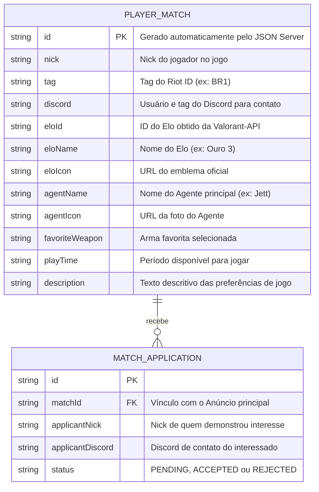

# 🛠️ Especificação Técnica (Tech Spec) — My MatchMates

Este documento detalha a arquitetura técnica, o modelo de dados e os contratos de API (via JSON Server e Valorant-API) necessários para o funcionamento da plataforma de matchmaking **My MatchMates**.

## 1. Modelo de Dados (Diagrama ER)

Abaixo está o Diagrama Entidade-Relacionamento (DER) que representa a estrutura do nosso "banco de dados" (`db.json`) e como as informações se conectam aos dados da API externa pública.



```
    {
  "anuncios": [
    {
      "id": "1",
      "nick": "SovaMain",
      "tag": "BR1",
      "discord": "sova_god#1234",
      "eloId": "gold_3",
      "eloName": "Ouro 3",
      "eloIcon": "[https://media.valorant-api.com/competitivetiers/5641823f-4b7c-16d5-aa63-d1b22340d588/14/smallicon.png](https://media.valorant-api.com/competitivetiers/5641823f-4b7c-16d5-aa63-d1b22340d588/14/smallicon.png)",
      "agentName": "Sova",
      "agentIcon": "[https://media.valorant-api.com/agents/320b2a18-4d9b-a01c-abc0-19a4577b7068/displayicon.png](https://media.valorant-api.com/agents/320b2a18-4d9b-a01c-abc0-19a4577b7068/displayicon.png)",
      "favoriteWeapon": "Vandal",
      "playTime": "Noturno (19h - 23h)",
      "description": "Procuro duo focado em subir para o Platina. Jogo focado na comunicação e pixel de revelação."
    }
  ],
  "solicitacoes": [
    {
      "id": "1",
      "matchId": "1",
      "applicantNick": "JettCarry",
      "applicantDiscord": "jett_diff#9999",
      "status": "PENDING"
    }
  ]
}
```
