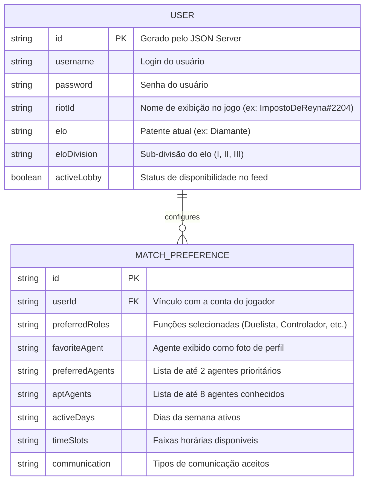

# 🛠️ Especificação Técnica (Tech Spec) — My MatchMates

Este documento detalha a arquitetura técnica, a stack tecnológica, o modelo de dados e os contratos de API do sistema **My MatchMates**.

## 1. Stack Tecnológica e Versões

- **Framework CSS:** Bootstrap v5.3.8 (Grid responsivo, utilitários de layout e componentes JS nativos como Modais para atendimento ao ID 04).
- **Preprocessador CSS:** Sass/SCSS v1.85.0+ (sobrescrita de variáveis nativas com a paleta dark/neon do Valorant).
- **JavaScript:** ES6+ Vanilla JS + jQuery v3.7.1 (manipulação do DOM, formulário em etapas e consumo de dados).
- **API Fake Local:** JSON Server (Persistência dos dados da coleção `users`).
- **API Pública Externa:** Valorant-API Build 11 | Versão v13.05.00.5350494 (`https://valorant-api.com/`) para consulta dinâmica de mídias.

---

## 2. Modelo de Dados (Diagrama ER)



```
{
  "users": [
    {
      "id": "1",
      "username": "impostodereyna",
      "password": "senha_segura_aqui",
      "riotId": "ImpostoDeReyna#2204",
      "elo": "Diamante",
      "eloDivision": "I",
      "activeLobby": true,
      "preferredRoles": ["Controlador", "Duelista"],
      "favoriteAgent": "Reyna",
      "preferredAgents": ["Omen", "Reyna"],
      "aptAgents": ["Reyna", "Omen", "Jett", "Killjoy", "Sova", "Viper", "Fade", "Clove"],
      "activeDays": ["Sex", "Sáb", "Dom"],
      "timeSlots": ["Noite", "Madrugada"],
      "communication": ["Microfone", "Discord Call"]
    }
  ]
}
```
