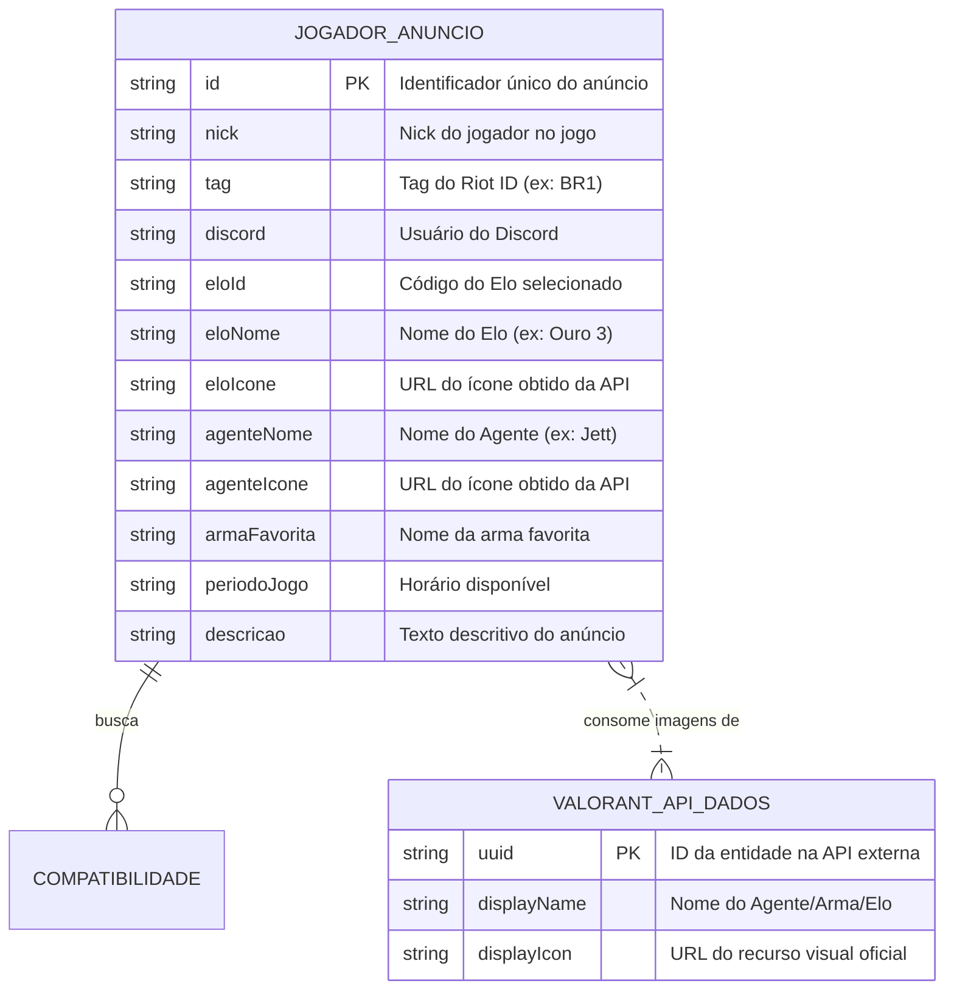

# Software Design Document (Architecture) — My MatchMates

## 1. Visão Geral da Arquitetura
A aplicação adota uma arquitetura Client-Side Rendering (CSR) construída com HTML5 semântico, CSS3/Sass, Bootstrap 5 e JavaScript Vanilla (ES6+). 

A persistência de dados de anúncios criados pelos usuários é realizada via requisições HTTP para uma API Fake local (JSON Server), enquanto imagens e metadados oficiais do jogo (Agentes, Armas e Emblemas de Elo) são consumidos assincronamente da API pública **Valorant-API**.

## 2. Diagrama de Modelo de Dados (Mermaid)

## 3. Descrição das Entidades
* **JOGADOR_ANUNCIO (JSON Server / db.json):** Entidade principal do sistema. Armazena os dados cadastrados pelos usuários via formulário e persiste os registros na API Fake local.
* **VALORANT_API_DADOS (API Pública Externa):** Dados dinâmicos de leitura consumidos da URL `https://valorant-api.com/v1/` para preencher os seletores do formulário e fornecer os ativos visuais (imagens) para a entidade de anúncios.

## 4. Tecnologias e Dependências
* **Front-end:** HTML5, CSS3, Sass (SCSS), JavaScript (ES6+ Fetch API).
* **Framework CSS:** Bootstrap 5 (Grid System, Flexbox, Cards, Modais, Navbar).
* **Bibliotecas JS:** jQuery + jQuery Mask Plugin.
* **Ambiente de Dados:** JSON Server (`db.json`) e Web Storage (`localStorage`).
* **Hospedagem:** GitHub Pages.