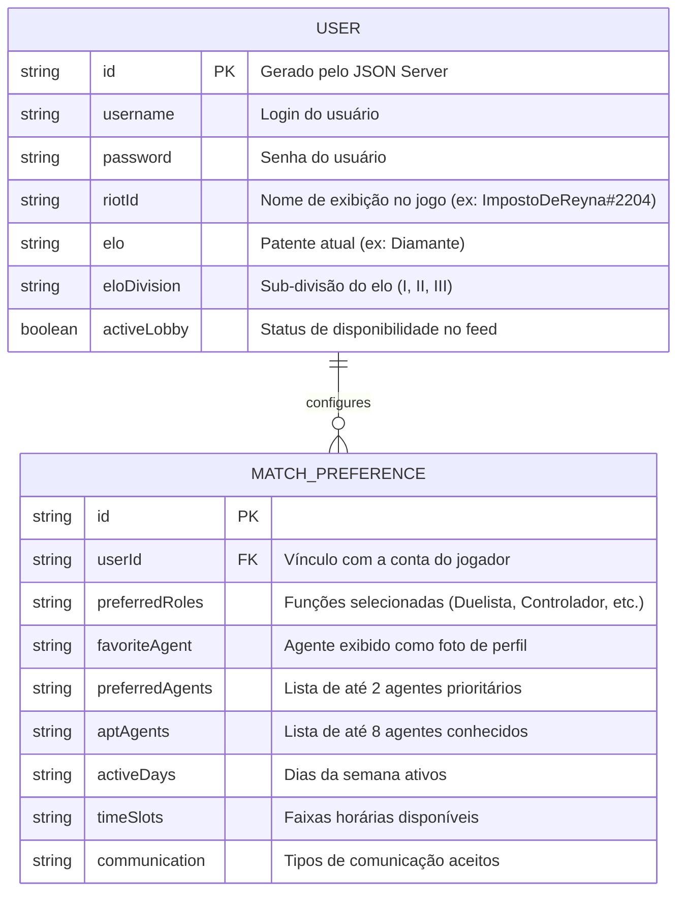

# 🛠️ Especificação Técnica (Tech Spec) — My MatchMates

Este documento detalha a arquitetura técnica, a stack tecnológica, o modelo de dados e os contratos de API do sistema **My MatchMates**.

## 1. Stack Tecnológica e Versões

- **Framework CSS:** Bootstrap v5.3.8.
- **Preprocessador CSS:** Sass/SCSS v1.85.0+.
- **JavaScript:** ES6+ Vanilla JS + jQuery v3.7.1.
- **API Fake Local:** JSON Server.
- **API Pública Externa:** Valorant-API Build 11 | Versão v13.05.00.5350494 (`https://valorant-api.com/`).

---


### 2. Paleta de Cores (Customização)

As variáveis de cor do framework foram escolhidas para induzir o usuário ao erro ou alertá-lo (tarde demais) sobre as taxas:

- **Cor Primária (Botões/Seleções):** `#FF4654`
  - _Uso:_ Botões de formulários, seleções e opções interagíveis ao usuário.
- **Cor Secundária (Emphasis):** `#BA3B46`
  - _Uso:_ Pequenos títulos ou seleções já feitas.
- **Cor de destaque de texto (Contrast):** `#FFFFFF`
  - _Uso:_ Usado em textos explicativos e títulos.
- **Cor de Fundo (Background):** `#0D141E`
  - _Uso:_ Fundo de todas as páginas após o login.
- **Cor de destaque de fundo (Background Emphasis):** `#17212F`
  - _Uso:_ Usado em abas específicas para delimitar áreas, sobrepõe parcialmente o fundo.
- **Cor de espera: (Waiting)** `#585858`
  - _Uso:_ Usado em botões inativos e para acessar a aba de cadastro.

### 3. Tipografia

Importada via Google Fonts para substituir a fonte padrão do navegador e dar um ar mais moderno:

- **Títulos (H1 a H6) e subtítulos:** `Space Grotesk`.
- **Textos Corridos, Inputs e Tabelas de Extrato:** `Space Grotesk, Arial`.
  
## 4. Modelo de Dados (Diagrama ER)


```mermaid
erDiagram
    USER ||--o{ MATCH_PREFERENCE : configures
    USER {
        string id PK "Gerado pelo JSON Server"
        string username "Login do usuário"
        string password "Senha do usuário"
        string riotId "Nome de exibição no jogo (ex: ImpostoDeReyna#2204)"
        string elo "Patente atual (ex: Diamante)"
        string eloDivision "Sub-divisão do elo (I, II, III)"
        boolean activeLobby "Status de disponibilidade no feed"
    }

    MATCH_PREFERENCE {
        string id PK
        string userId FK "Vínculo com a conta do jogador"
        string preferredRoles "Funções selecionadas (Duelista, Controlador, etc.)"
        string favoriteAgent "Agente exibido como foto de perfil"
        string preferredAgents "Lista de até 2 agentes prioritários"
        string aptAgents "Lista de até 8 agentes conhecidos"
        string activeDays "Dias da semana ativos"
        string timeSlots "Faixas horárias disponíveis"
        string communication "Tipos de comunicação aceitos"
    }

```
## 5. Dicionário de Dados — Coleção `users`

A coleção `users` centraliza a conta e as preferências táticas de cada jogador em uma única estrutura no `db.json`.

### 1. Credenciais e Identificação do Usuário
* **`id`** *(string, Obrigatório)* — Identificador único da conta gerado automaticamente pelo JSON Server.  
  *Exemplo:* `"1"`
* **`username`** *(string, Obrigatório)* — Nome de usuário utilizado para login na aplicação.  
  *Exemplo:* `"impostodereyna"`
* **`password`** *(string, Obrigatório)* — Senha de acesso validada durante o fluxo de autenticação.  
  *Exemplo:* `"Senha123@"`
* **`riotId`** *(string, Obrigatório)* — Nickname e Tag oficiais do jogo exibidos no card e utilizados no botão "Copiar ID".  
  *Exemplo:* `"ImpostoDeReyna#2204"`

### 2. Patente e Disponibilidade em Tempo Real
* **`elo`** *(string, Obrigatório)* — Patente atual do jogador no Valorant, utilizada no cruzamento de dados com a Valorant-API.  
  *Exemplo:* `"Diamante"`, `"Radiante"`, `"Ferro"`
* **`eloDivision`** *(string, Obrigatório)* — Subdivisão da patente competitiva do usuário.  
  *Exemplo:* `"I"`, `"II"`, `"III"`
* **`activeLobby`** *(boolean, Obrigatório)* — Define se o jogador está visível no feed da aba "Explorar" procurando grupo no momento.  
  *Exemplo:* `true` ou `false`

### 3. Preferências Táticas e Pool de Agentes
* **`preferredRoles`** *(array de strings, Obrigatório)* — Lista com até 2 funções táticas prioritárias no jogo.  
  *Exemplo:* `["Controlador", "Duelista"]`
* **`favoriteAgent`** *(string, Obrigatório)* — Agente principal que fornece a imagem de avatar/foto de perfil no card.  
  *Exemplo:* `"Reyna"`
* **`preferredAgents`** *(array de strings, Obrigatório)* — Lista com até 2 agentes prioritários da escolha do jogador.  
  *Exemplo:* `["Omen", "Reyna"]`
* **`aptAgents`** *(array de strings, Obrigatório)* — Pool de até 8 agentes que o jogador domina e sabe jogar em partidas competitivas.  
  *Exemplo:* `["Reyna", "Omen", "Jett", "Killjoy", "Sova", "Viper", "Fade", "Clove"]`

### 4. Rotina e Comunicação
* **`activeDays`** *(array de strings, Obrigatório)* — Dias da semana em que o usuário costuma jogar.  
  *Exemplo:* `["Sex", "Sáb", "Dom"]`
* **`timeSlots`** *(array de strings, Obrigatório)* — Turnos habituais de disponibilidade para partidas.  
  *Exemplo:* `["Manhã", "Tarde", "Noite", "Madrugada"]`
* **`communication`** *(array de strings, Obrigatório)* — Meios de comunicação aceitos pelo jogador durante a partida.  
  *Exemplo:* `["Microfone", "Discord Call", "Chat/ping"]`

## 6. Estrutura do Banco de Dados (db.json)

```
{
  "users": [
    {
      "id": "1",
      "username": "impostodereyna",
      "password": "senha_segura_aqui",
      "riotId": "ImpostoDeReyna#2204",
      "elo": "Diamante",
      "eloDivision": "I",
      "activeLobby": true,
      "preferredRoles": ["Controlador", "Duelista"],
      "favoriteAgent": "Reyna",
      "preferredAgents": ["Omen", "Reyna"],
      "aptAgents": ["Reyna", "Omen", "Jett", "Killjoy", "Sova", "Viper", "Fade", "Clove"],
      "activeDays": ["Sex", "Sáb", "Dom"],
      "timeSlots": ["Noite", "Madrugada"],
      "communication": ["Microfone", "Discord Call"]
    }
  ]
}
```
